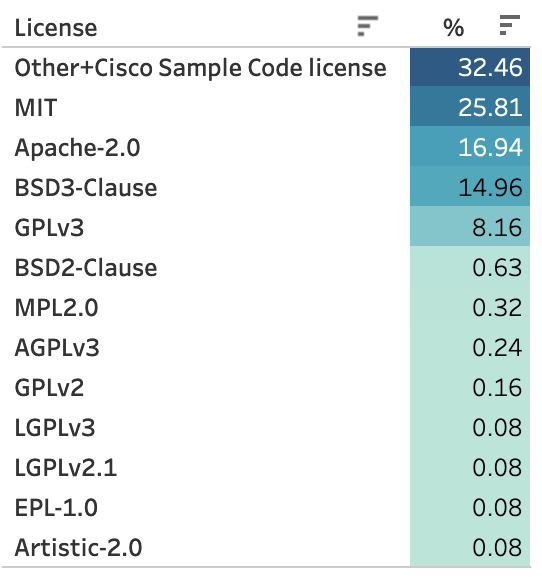
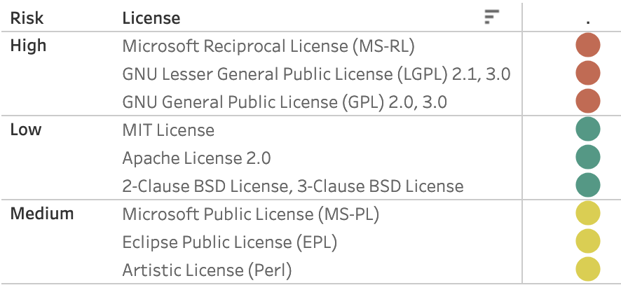
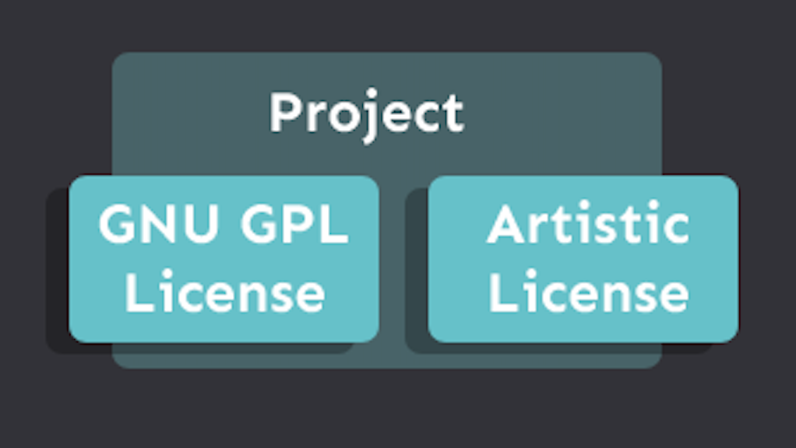
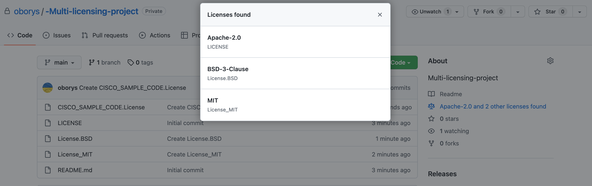
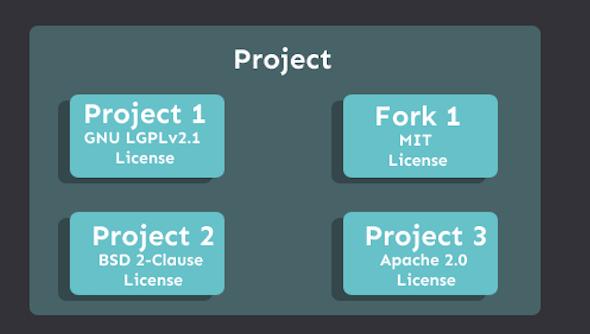
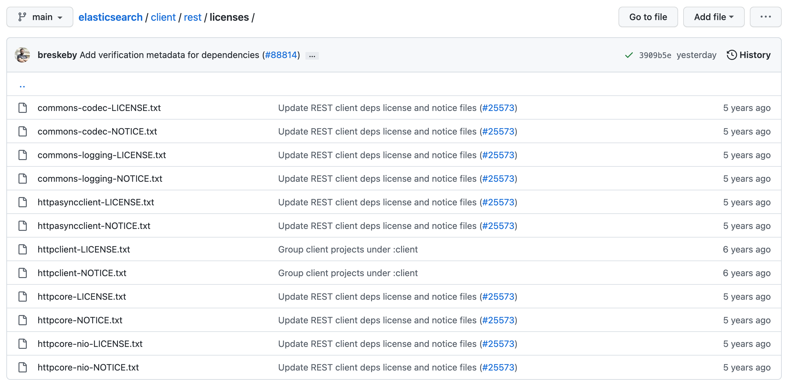
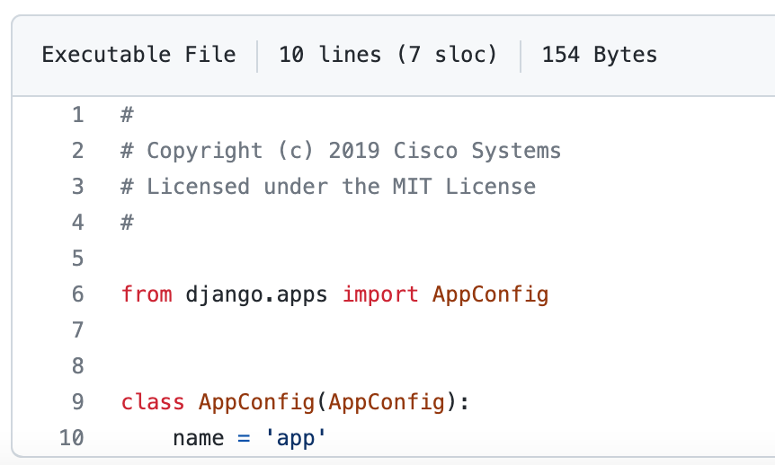
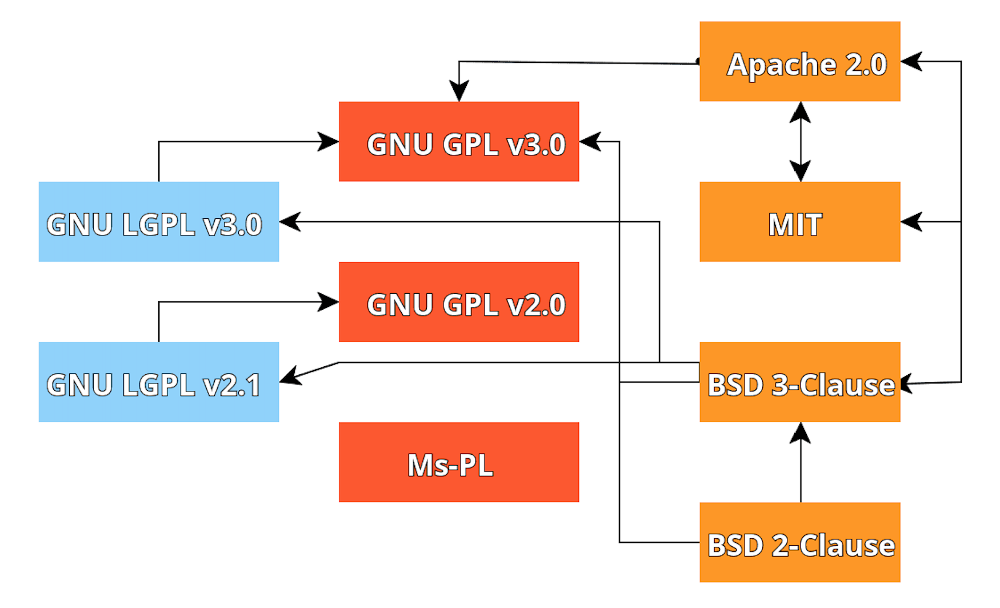

# Open-source license guide for Code and Automation Exchange platforms

An open-source license is an essential part of the project. The license should keep information about included projects and newly created source files.

A license for open-source projects is a legal contract that regulates the relationship between the author or authors and the user. The license describes the terms of use of the project or code, including in commercial programs. In addition, the license defines what others can and cannot do with the software components, obligations, and features of use.

If you want to create or submit a use case for the Exchange platform, the following information helps you choose a related license and manage open source license issues.

This document helps you understand the following use cases. Choose the one that is appropriate for your project:

- [Create your project from scratch.](#create-your-project-from-scratch)
- [Friendly licenses for proprietary software.](#friendly-licenses-for-proprietary-software)
- [Multi-licensing, or applying more than one license to the project.](#multi-licensing)
- [The project includes a fork or part of another project with different licenses. Compatibility of licenses.](#forked-projects)
- [Projects without a license](#projects-without-a-license)

## Create your project from scratch

If you have a new simple project or automation use case where you are confident that partners and customers can use it, choose one of the following licenses:

### MIT License

This license is simple and straightforward. It does not require additional NOTICE files, and you can use the copyright of any organization and trademark.

**Projects using MIT**: Visual Studio Code, Julia Language, Electron, Angular.js, Rails

### Apache 2.0

If your project involves other contributors and you also want to settle patent issues, use Apache 2.0.

Compared to other permissive licenses, this license includes a clause concerning patents ("3. Grant of Patent License"). The clause governs the disposal of patents, which means that participants grant permission to use any of their patents that may relate to their contribution.

Also, if you have modified parts of the files or code, you can apply for a new license. Indicate all files that have been changed.

**Projects using Apache 2.0**: Kubernetes, Selenium, TensorFlow

### The 3-Clause BSD License

The modified 3-Clause BSD version includes a non-maintenance clause. This clause protects you or the contributor from having your name used in the project if you don't want it.

**Projects using BSD**: Flutter, libssh2

### GNU Lesser General Public License (LGPL)

GNU LGPL is an ideal choice for libraries and packages. Until 1999, the license was called the GNU Library General Public License.

The license was created to not violate the principles of free software, so that developers can use this license for their libraries, and scripts. Other developers and companies can use the relevant projects with the LGPL license without affecting the license of the general or compiled project, including commercial ones.

The following diagram shows statistics for the licenses that are used on the Cisco Exchange platforms. The data includes published use cases as of August 2022.

## Friendly licenses for proprietary software

Which license you should choose for easy use project as part of proprietary software? There are two types of licenses:

- **Copyleft** (GNU, Microsoft Public License),
- **Permissive** (Apache, MIT, BSD)

Copyleft can also be divided into "weak" and "strong". "Strong" includes GNU, and the "weak" includes Eclipse and the GNU LGPL. For weak Copyleft licenses, it is permissible to compile different binary files and release the result with another type of license or not to change the license of the source project.

Permissive licenses are also known as "commercially friendly".

The following diagram shows a list of licenses with a level of risk relative to use in proprietary software. The greater the risk, the greater the problem of using properly licensed components in your proprietary (or paid) software.

## Multi-licensing

Some projects are released and published under two or more licenses. Often, multi-licensing in a project involves using both copyleft and proprietary licenses. This principle gives users and organizations more freedom in using the project or code.

Supporters of the free distribution of code and programs can, for example, leave the GPL license. Proprietary licenses can be used by developers who want to monetize their products or use the project in commercial solutions with patenting and without publishing the code. In addition, several licenses allow you and users to use one of the corresponding licenses. This avoids conflict of licenses when integrating the project into the main application or project in which solutions with other licenses were already involved.

An example of multi-licensing is the Perl programming language. Perl has a [GPL](https://github.com/Perl/perl5/blob/blead/Copying) license in the Copying file, and the [Artistic](https://github.com/Perl/perl5/blob/blead/Artistic) license in the root directory. The README states that it is possible to distribute and modify the project according to the terms of one of the licenses. In addition, the License file may not contain the text of the license directly, but information about the licenses under which the project is published or the projects/libraries included in it.

### Multi-licensing in GitHub

For multi-licensing in GitHub, you must name your license file with the keyword `License`; for example, `License.BSD`, `License_MIT`, and so on. Add related license text inside this file and place the license file or files in the root directory of your project.

Submitters and open-source project contributors can also add different licenses to the project, such as the [Cisco Sample Code license](https://developer.cisco.com/site/license/cisco-sample-code-license/).

## Forked projects

You may have a project that includes a fork or part of another project with different licenses.

When your open source project contains forks of other projects or uses project code with different licenses and copyrights, create a separate directory where you place the licenses of the projects that are used in your project. Refer to the following examples:

- [Kubernetes](https://github.com/kubernetes/kubernetes/tree/master/LICENSES)
- [Elasticsearch client](https://github.com/elastic/elasticsearch/tree/main/client/rest/licenses)
- [CockroachDB](https://github.com/cockroachdb/cockroach/blob/master/LICENSE).

The following diagram shows an example of organizing information about licenses that are used in different parts of Elasticsearch:

A recommended practice is to add appropriate license and copyright information to each code file, as shown in the following example:

### Compatibility of licenses

Each application or program usually involves many different libraries, and projects, each of which has its license with its own set of conditions. So how can you ensure that all the licenses you use are compatible and compliant?

The following diagram shows an example of compatible licenses.

If the licenses are compatible, there is an arrow between them. The direction of the arrow indicates the more substantial license. A substantial, strong, inclusive license is a license that essentially includes all the key terms of another license.

## Projects without a license

If the project is published without a license, the project **cannot** be used.
By default, the software is protected by exclusive copyright, and without a license, use is illegal, even if the project is published. The license grants permission to use, copy, distribute, or modify the software without risk of infringement if the terms are met.
We **cannot** publish projects without a license on our project exchange platforms. Most organizations and companies also do not publish their projects without licenses.
